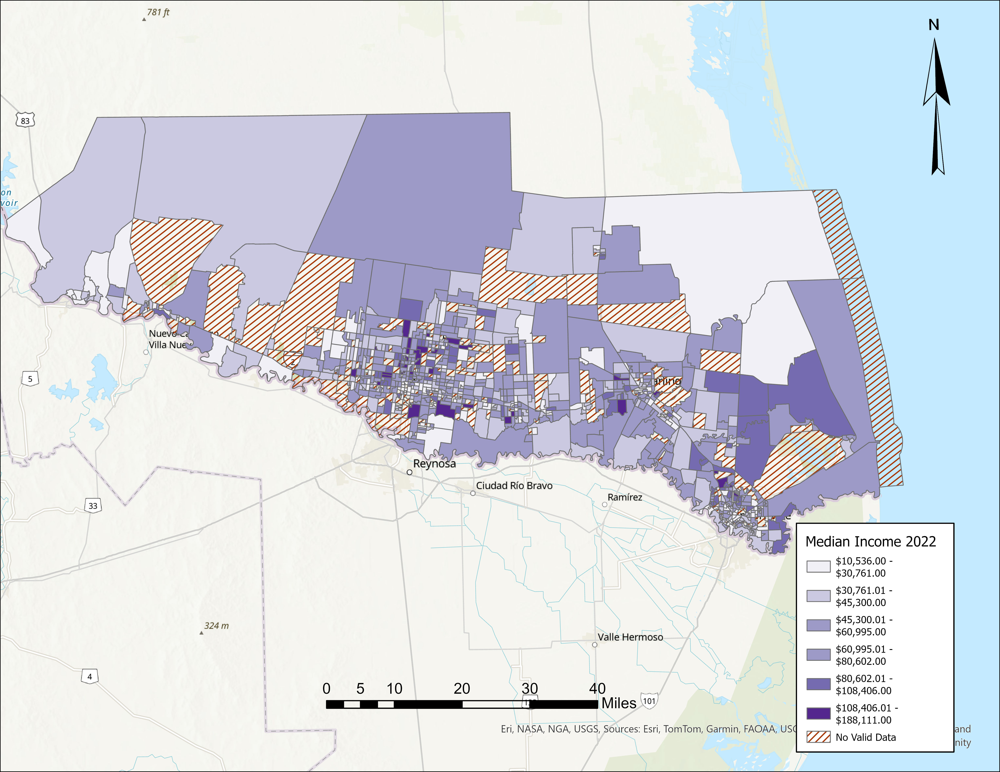

## Portfolio

---

### Cartographic & Coding Skills 

[SpaceX vs. Median Income of the Rio Grande Valley](https://github.com/sbelmontes/sbelmontes.github.io/blob/master/pdf/Thematic%20Mapping%20of%20Rio%20Grande%20Valley.pdf)

---
[Python Code of SpaceX vs. MedInc of RGV](https://github.com/sbelmontes/sbelmontes.github.io/blob/master/pdf/Coded%20SpaceX.pdf)

---
[Project 3 Title](http://example.com/)

---

### Related Links

- [Thematic Mapping of Rio Grande Valley](https://storymaps.arcgis.com/stories/749a7502f2ac42d0ad77cab42c3e02f4)
- [Project 2 Title](http://example.com/)
- [Project 3 Title](http://example.com/)
- [Project 4 Title](http://example.com/)
- [Project 5 Title](http://example.com/)

---

---

Page template forked from <a href="https://github.com/evanca/quick-portfolio">evanca</a>

<!-- Remove above link if you don't want to attibute -->
